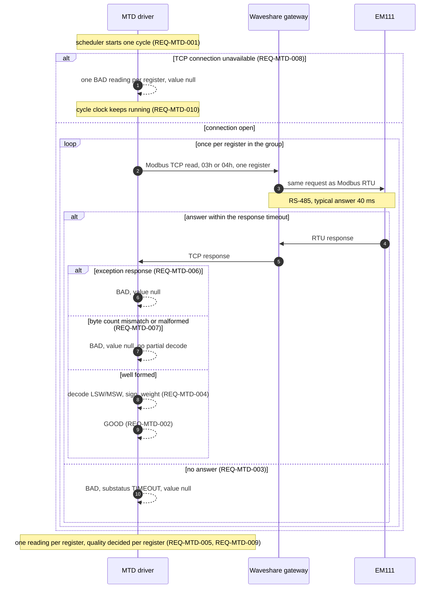

# Modbus TCP driver: Technical Design

- **Related:** requirements.md, pseudo.md, ADR-0004 (draft), ADR-0020, ADR-0010
  (superseded, context only), ADR-0003

### LOG
- Log is for tracking requirements implementation from requirements.md

1. Starting Requirements REQ-MTD-001 -- 15.9.26

## Components

| Component | Owns | Does not own |
|---|---|---|
| `scheduler` | The cycle clock: the configured polling interval, when the next cycle is due, and starting exactly one cycle at a time. | Error handling, Modbus protocol, connection state |

`scheduler` serves REQ-MTD-001 and REQ-MTD-010. It holds the next due time and
no previous readings. That absence is deliberate: remembering values is what
`STALE` detection needs, and ADR-0004 gives `STALE` to the quality gate.

The connection belongs elsewhere, but REQ-MTD-010 pins what its state does to
the clock: nothing. A dead gateway neither stops nor resets the cycle, the next
cycle retries on its own, and a returning gateway needs no restart.

One cycle at a time is a constraint, not a preference. ADR-0020 option A leaves
the gateway without queueing, so a second request while one is in flight
collides on the RS-485 bus. ADR-0020 names a second master as that case; an
overlapping cycle of our own is the same collision, by inference.

NFR-MTD-001 is the only measurable claim about `scheduler`, and its tolerance
has no source yet.


## Implementation considerations

### Modbus library

**Modbus client library.** Two maintained open source candidates, checked
against the npm registry and the downloads API on 2026-09-15. Chosen:
`modbus-serial` 8.0.25, installed 2026-09-17 and pinned by `save-exact=true`.
It carries roughly twice the downloads, and its optional `serialport` costs
nothing here because the RS-485 side belongs to the gateway.

| | `modbus-serial` | `jsmodbus` |
|---|---|---|
| Version | 8.0.25 | 5.0.0 |
| License | ISC | MIT |
| Downloads, 2026-09-05 to 09-11 | 37 849 | 16 133 |
| `serialport` | Optional dependency (`^13.0.0`) | Not a dependency (`crc`, `debug`, `commander`) |
| Repository | `yaacov/node-modbus-serial` | `Cloud-Automation/node-modbus` |

The `serialport` row matters only because `.npmrc` sets
`ignore-scripts=true`, so a native `serialport` would need `npm rebuild`.
Neither library forces it: `modbus-serial` keeps it optional, `jsmodbus` does
not pull it at all. MTD needs no serial port in any case. The RS-485 side of
the bus belongs to the gateway, and the Pi reaches it over Ethernet
(`README.md` topology).

What either library hands back above the wire is not settled here.
`modbus-serial` was noted earlier as returning raw 16-bit words, `jsmodbus`
has not been checked. REQ-MTD-004 puts word order, sign and the register
weight in this project's own code either way.

Other packages exist and were not compared.

### TypeScript

Both libraries ship their own declarations, so neither needs `@types`.
`jsmodbus` generates them from its TypeScript source, `modbus-serial` keeps a
hand-written `index.d.ts` that can drift from the implementation. Both are
CommonJS with no `exports` field, and this package is `"type": "module"`, so
import them as a default import.

`tsconfig.json` needs `"types": ["node"]` before the first timer is written.
TypeScript 6 changed the default to `[]`, and `setInterval` and `Buffer` come
from `@types/node`, not from `lib`. Untested: nothing here uses a Node global
yet, so `npm run typecheck` still passes.

## Sequence: one poll cycle

Simple mode, so every query reaches the meter and nothing is answered from a
cache (ADR-0020). Registers are read one at a time rather than as one
multi-word request, because `000Bh` answers differently depending on read
width (`hardware/carlo-gavazzi-em111/configuration.md`).

> [!NOTE]
> A retry after an unanswered query is deliberately not drawn. It is undecided,
> and requirements.md's open questions point at this file's D2 for it.

The driver is one participant here. Its internal split is the Components
table, and `scheduler` appears only as what starts the cycle.



## Data model / interface

Sketch, not the final `src/types/` file. The `Reading` envelope itself is
defined once in ADR-0004 and is not restated here; below is only what MTD
takes in, what it hands out, and which parts of the envelope it narrows.

### In: the register group

```ts
// Sketch only. Should be updated when we fetch data again using modbus library.
type RegisterSpec = {
  name:            string;  // becomes Reading.source.point
  physicalAddress: string;  // e.g. '0004h'
  words:           number;  // 1 or 2 on this meter
  type:            'int16' | 'int32' | 'uint16' | 'ascii';
  weight:          number;  // REQ-MTD-004: value = raw / weight
  unit:            string;  // becomes Reading.unit
};

type RegisterGroupConfig = {
  pollIntervalMs: number;          // REQ-MTD-001
  registers:      RegisterSpec[];  // order is the read order within a cycle
};
```

An object holding an array: the group carries state of its own (the interval),
the registers are an ordered list because ADR-0020 option A does not queue, so
they are read one at a time.


## Error handling and edge cases

Not implemented yet -> happy path 1st.
What happens when the happy path breaks? Be explicit about timeouts,
malformed data, and what the system does when it genuinely doesn't know
the answer (this is where the `UNCERTAIN` quality value earns its place).

## Testing strategy
Waiting for req 001
Which REQ is proven how. Unit tests for logic that needs no hardware, bench
tests for anything the wire decides. Prefer recorded values over invented
ones.

| REQ | Test | Where |
|---|---|---|
| REQ-n | ... | ... |

## Open questions

Anything still unresolved that shouldn't block writing this doc, but
should block marking it "Accepted".
