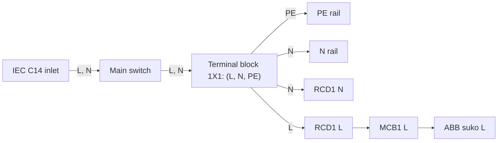

# Enclosure Wiring

- **Revision:** 1
- **Date:** 2026-09-09
- **Related:** ADR-0009 (parts and branch-topology decision),
  `docs/bringup-enclosure-assembly.md`

## Verification

- [X] Checked against a photo of the assembled enclosure
- [X] Checked against the physical unit, breaker by breaker, before
      energising
- [X] Terminal numbers on each device confirmed against its own datasheet
      or nameplate (this diagram does not assert exact terminal numbers
      unless a datasheet was checked)

## Revision log

| Rev | Date | Change |
|---|---|---|
| 1 | 2026-09-09 | First version: main circuit, 5V and 24V DC circuits |

## Main circuit (230V AC)

Scope: IEC inlet through to the DIN-suko socket. The two DC supplies have
their own circuits below, fed from the same terminal block but not
routed through the RCD.

## Terminal-by-terminal

1. IEC C14 inlet (GSD336-63) → main switch (B448PUIP65): L and N jumpered
   directly.
2. Main switch → terminal block "1X1": L and N jumpered.
3. Terminal block "1X1" (L, N, PE rows):
   - PE → PE rail
   - N → N rail **and** RCD's N terminal
   - L → RCD terminal 1 (in)
4. RCD (GWS4032) terminal 2 (out, L) → MCB1 (GW92006) terminal 1 (in)
5. MCB terminal 2 (out, L) → DIN-suko socket

## 24V DC circuit (Waveshare)

## 5V DC circuit (Pi)

Both DC supplies sit behind the same second 10A breaker, separate from
the RCD-protected main circuit above. Neither is routed through the RCD
(ADR-0009: fixed supplies caused nuisance trips there).
