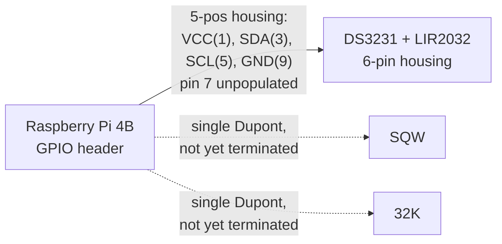

# Pi to RTC Wiring

- **Revision:** 4
- **Date:** 2026-09-09
- **Related:** ADR-0001 (RTC decision, already approved, not modified here),
  `docs/adr/0004-reading-envelope-quality.md` (dual timestamp this RTC
  protects)

## Scope

DS3231 (with LIR2032 backup cell) to the Raspberry Pi 4B, over I2C.
This document implements a decision ADR-0001 already made; it does not
revisit the decision itself.

## Connection

The DS3231 breakout exposes 6 pins: `VCC`, `GND`, `SDA`, `SCL`, `SQW`,
`32K`.

The Pi's I2C1 bus (`SDA`/`SCL`) carries a fixed 1.8 kΩ pull-up to 3.3V
on both lines. No external pull-up resistors are needed, and these two
pins are not available for general-purpose IO while I2C1 is in use.
Source: [pinout.xyz](https://pinout.xyz/).

**As built (custom crimped harness, 10-colour thin ribbon wire):**

| Wire colour | Signal | DS3231 pin | Pi physical pin | Pi BCM/GPIO |
|---|---|---|---|---|
| Blue | VCC | ✓ | 1 | — (3.3V) |
| Green | GND | ✓ | 9 | — |
| Violet | SDA | ✓ | 3 | GPIO2 |
| Grey | SCL | ✓ | 5 | GPIO3 |
| White | SQW | ✓ | single Dupont, not yet terminated | ? |
| Black | 32K | ✓ | single Dupont, not yet terminated | ? |

Two Dupont housings:
- **DS3231 end:** one 6-pin housing, all 6 positions populated
  (VCC/GND/SDA/SCL/SQW/32K).
- **Pi end:** one 5-position housing spanning physical pins 1, 3, 5, 7, 9
  (one row of the header), with the position for physical pin 7 (GPIO4)
  deliberately left unpopulated since it isn't a signal this harness
  uses. Carries VCC/SDA/SCL/GND only.
- `SQW` and `32K` run out as individual single-pin Dupont jumpers,
  separate from the 5-position block, not yet plugged into anything.

The whole assembly sits inside the Pi's own aluminium case (the
metal enclosure + thermal pads already noted for the Pi in
`docs/PROJEKTIN-TILA.md`), not inside the ADR-0009 distribution
enclosure.

## Notes

`SQW` and `32K` are deliberately left floating: loose Dupont ends,
kept apart from each other and from anything else so they cannot
short. Not connected to any GPIO. Intentional isolation, not an
unfinished connection.

## Verification

- [x] Pin mapping filled in above, sourced from pinout.xyz
- [x] Pin mapping checked against the physical header (as-built harness
      confirmed 2026-09-09)
- [ ] `i2cdetect` shows the DS3231 at its expected address on the Pi
- [ ] Time survives a power cycle with no network present

## Revision log

| Rev | Date | Change |
|---|---|---|
| 1 | 2026-09-09 | Skeleton only, pin mapping not yet filled in |
| 2 | 2026-09-09 | Pin mapping filled in and sourced (pinout.xyz), pull-up note added |
| 3 | 2026-09-09 | Updated to as-built: custom crimped harness, two Dupont housings, SQW/32K run separately and unterminated |
| 4 | 2026-09-09 | Confirmed: SQW/32K are deliberately floating and isolated, not an open item |
